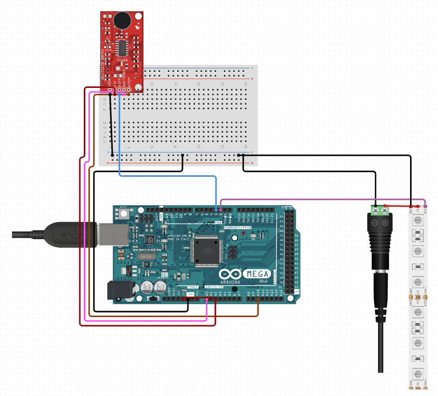
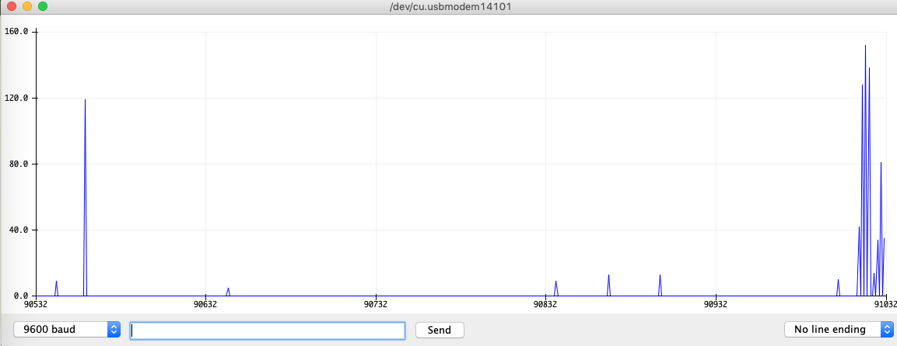

# Arduino Sound Sensor with FastLED

## Material
* Ardunio MEGA2560
* Breadboard
* Jumper wires
* 5V adapter
* Arduino sounds sensor
* WS2811 LED lights
* Ohm resistors

## Schematic

## Project Design
The purpose of the Ardunio project is to utilize a sound sensor to detect noise. The sensor has a digital output where HIGH indicates the absence of noise and LOW indicates the presence of noise. The algorithm adds the number of times noise is detected within a sampling window and outputs this number (i.e., each time, the sensor outputs LOW). The algorithm does not detect the noise frequency in terms of MHz, so the frequency in this algorithm refers to the number of times the sensor was triggered within the sampling window. For demonstration purposes, this algorithm is sufficient to trigger interesting light displays on a FastLED strip based on the noisiness of input as evidenced by Ardunio's serial plotter. 
  

### Sound Sensor
The sounds sensor's potentiometer controls the sensor's senitivity to the sound. The potentiometer requires caliberation prior to use. When a sound is detected, the sound sensor's sound detection LED turns on and the sensor outputs LOW. 

### FastLED
Arduino's FastLED library enables the programming of invidiual lights in an LED strip, which allows for interesting visuals such as creating light trails and adjusting brightness based on input.

### Further Research
This sound sensors digital output can be used for real world applications such as detecting noise to turn electronics on or off, triggering an alarm, or assessing the quietness of an environment. In the future, a sensor with an analog output along with an FFT algorithm will be utilized to detect sound frequency utilizing a range of data.

