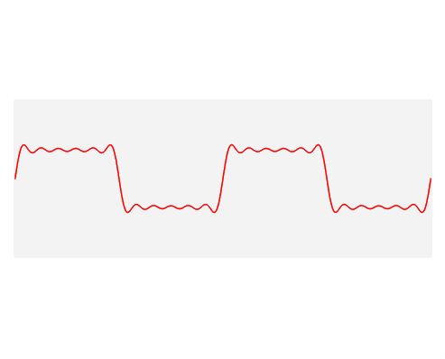

# Arduino Sound Sensor with FastLED
Samra Kasim

## Material
* Arduino MEGA2560
* Breadboard
* Jumper wires
* 5V adapter
* Arduino sounds sensor
* WS2811 LED lights
* Ohm resistors

## Schematic

## Sound Sensor
The sounds sensor's potentiometer controls the sensor's sensitivity to the sound. The potentiometer requires calibration prior to use. 
### Analog
A sound sensor can also have analog output, which is continuous output that changes with the intensity of sound detected by the sensor. Simply outputting the data received from the input pin results in meaningless data. However, for this project, Arduino's [arduinoFFT](https://www.arduino.cc/reference/en/libraries/arduinofft/) library is used to convert the received input into meaningful data. Specifically, the major peak detected during a sample window of 1000Hz is captured. For sound frequencies greater than 150Hz, the results were within a 5Hz range.

#### FFT
The FFT algorithm is considered one of the most important algorithms developed in the last century and has wide ranging uses, including signal processing and sound compression. The [FFT takes a tangle of sine waves](https://www.youtube.com/watch?v=zKKGA30bHG0) that are a time domain representation of a signal and converts it to a frequency domain representation. Therefore, FFT can be used to [deconstruct audio waves into different frequencies such as bass and treble or deconstruct earthquake vibrations](https://download.ni.com/evaluation/pxi/Understanding%20FFTs%20and%20Windowing.pdf).

[Gif source](https://en.wikipedia.org/wiki/Fourier_transform#/media/File:Fourier_transform_time_and_frequency_domains_(small).gif)

An app generated square waves of 250Hz and 75 Hz, the sound sensors utilized in this project captured the sound waves., an ArduinoFFT library [transformed](./arduino_sketches/fft_approx.ino) the analog input through an FFT algorithm. The following [notebook](./fft_ouptut_analysis.ipynb) analyzed the FFT output. 

### Digital
When a sound is detected, the sound sensor's sound detection LED turns on and the sensor outputs LOW. When no sound is detected, the sound sensor output HIGH indicates the absence of noise. The [algorithm](./arduino_sketches/fastled_with_sound_sensor_freq_detection.ino) adds the number of times noise is detected within a sampling window (i.e., each time, the sensor outputs LOW) and outputs this accumulated number. The algorithm does not detect the noise frequency in terms of Hz, so the frequency in this algorithm refers to the number of times the sensor was triggered within the sampling window. For demonstration purposes, this algorithm is sufficient to trigger interesting light displays on a FastLED strip that reflect the "noisiness" of the input. The chart below demonstrates the algorithm in Arduino's serial plotter, wherein the peaks reflect how many times the sensor was triggered.

 

### FastLED
Arduino's FastLED library enables the programming of individual lights in an LED strip, which allows for interesting visuals such as creating light trails and adjusting brightness based on input.

